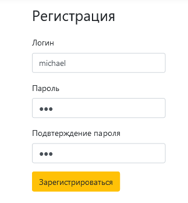

# Интерфейс приложения

## 1. Начальная страница неавторизованного пользователя

## 2. Начальная страница авторизованного пользователя

## 3. Начальная страница администратора

## 4. Форма регистрации

## 5. Сообщение пользователю

## 6. Список пользователей системы

## 7. Цены на продукты

## 8. Продукты пользователя

## 9. Покупки пользователя

